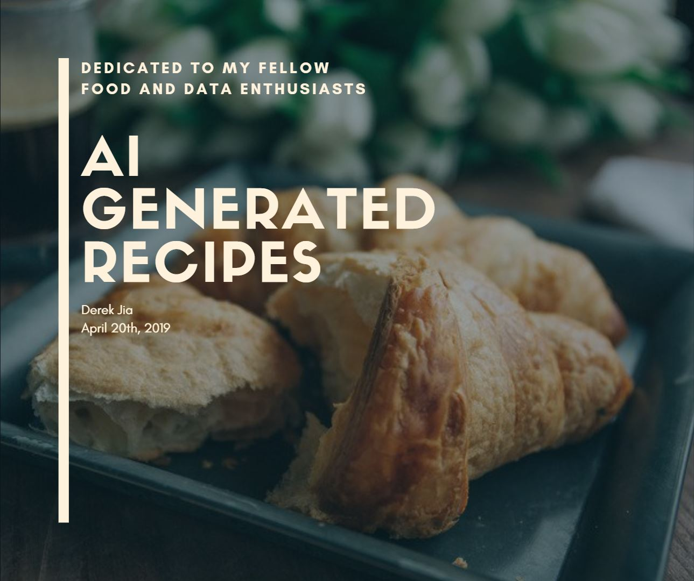

<i>A Project Built with Generative Adversial Network and the ❤️ of :hamburger: </i>

## Motivation for the Project

>  “There is no sincerer love than the love of food."
>         - George Bernard Shaw

Human facial expressions can be easily classified into 7 basic emotions: happy, sad, surprise, fear, anger, disgust, and neutral. Our facial emotions are expressed through activation of specific sets of facial muscles. These sometimes subtle, yet complex, signals in an expression often contain an abundant amount of information about our state of mind. Through facial emotion recognition, we are able to measure the effects that content and services have on the audience/users through an easy and low-cost procedure. For example, retailers may use these metrics to evaluate __customer interest__. Healthcare providers can provide better service by using additional information about __patients' emotional state__ during treatment. Entertainment producers can monitor __audience engagement__ in events to consistently create desired content.

## Table of Contents
1. [The Database](#1-the-database)
2. [The Model](#2-the-model)
	* [3.1 Input Layer](#31-input-layer)
	* [3.2 Convolutional Layers](#32-convolutional-layers)  
	* [3.3 Dense Layers](#33-dense-layers)
	* [3.4 Output Layer](#34-output-layer)
	* [3.5 Deep Learning](#35-deep-learning)
3. [Model Validation](#4-model-validation)
	* [4.1 Performance](#41-performance)
	* [4.2 Analysis](#42-analysis)
	* [4.3 Computer Vision](#43-computer-vision)
4. [The Apps](#5-the-apps)
	* [5.1 RESTful API](#51-restful-api)
	* [5.2 Interactive Web App](#52-interactive-web-app)
	* [5.3 Real-Time Prediction via Webcam](#53-real-time-prediction-via-webcam)
5. [About the Author](#7-about-the-author)
6. [References](#8-references)

## 6 About the Author

I've always loved math, ever since I Was four years old. Naturally, I gravitated towards a math heavy education. However, I felt pure math was too abstract, too intangible. I had a creative urge to build something with had a practical use in the real world. To explore the culinary world through a numerical lens. Thanks for taking the time to read my project.
