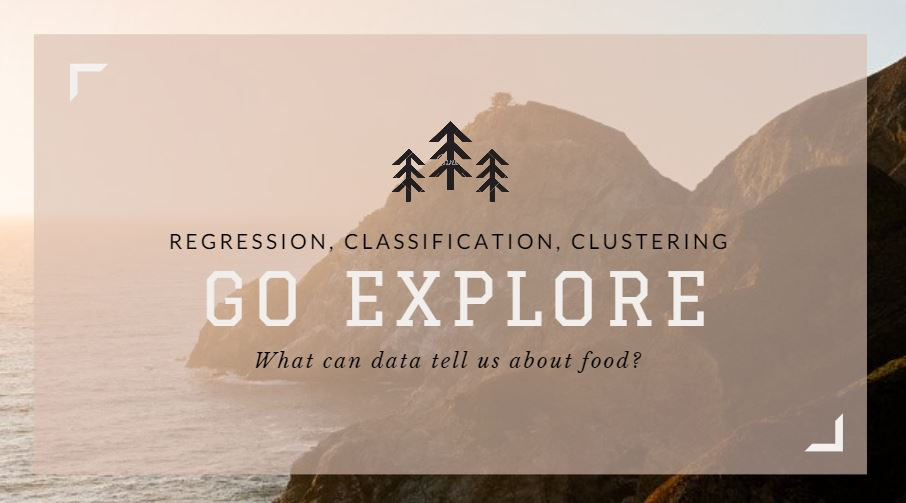
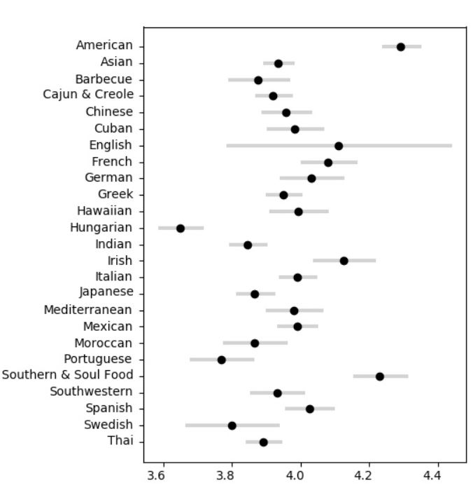
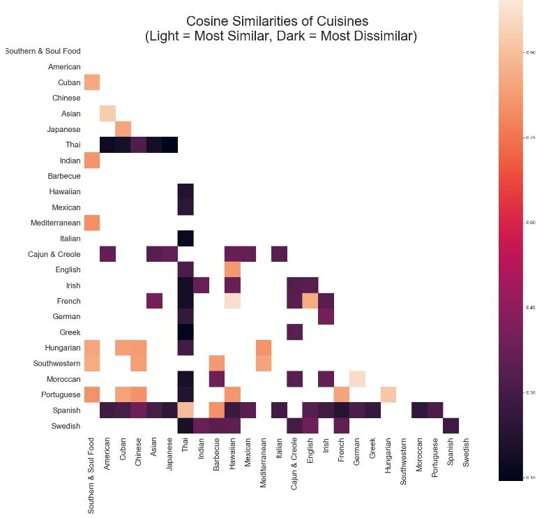
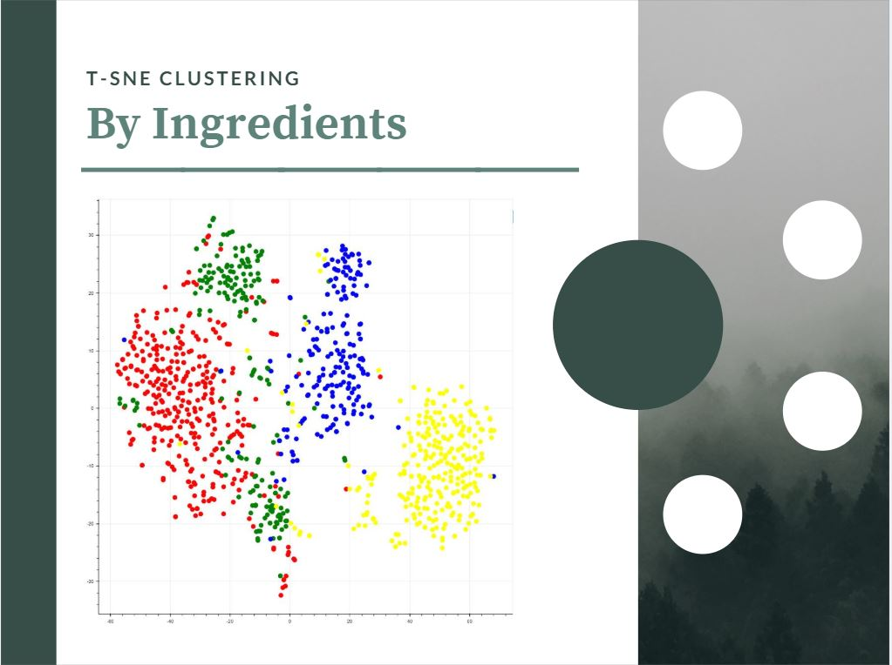
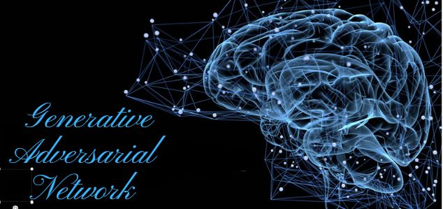
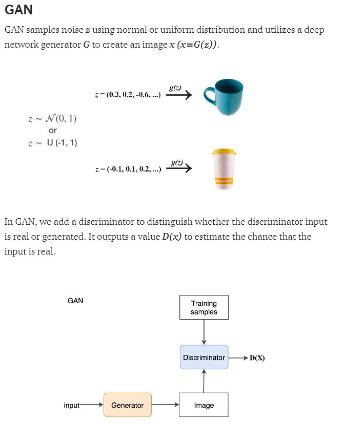
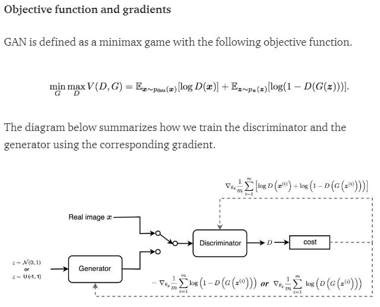
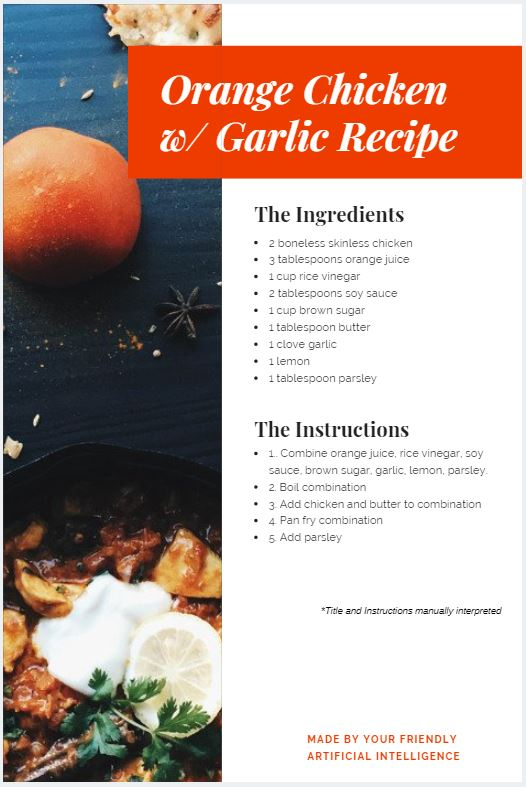
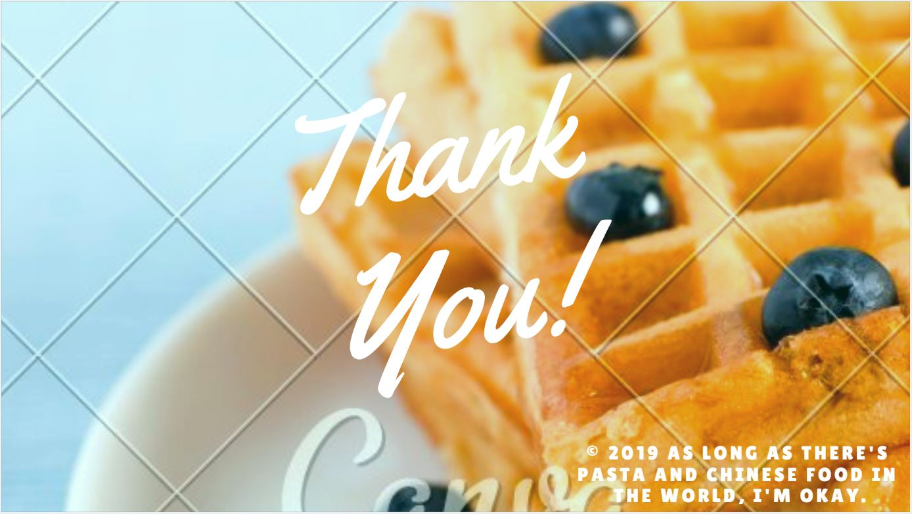

<i>A Project Built with a Generative Adversial Network and the ❤️ of :hamburger: </i>

## Motivation for the Project

  

>  “There is no sincerer love than the love of food."
>         - George Bernard Shaw

Deep learning has been used in many application to solve real-world problems. In recent years, it has seen tremendous growth in its popularity and usefulness, due to more powerful computers, larger datasets, and developments in the field of neural networks. Modern techniques have been transformative in the various fields: finance, engineers, chemistry, allowing professionals to push the edge of what is possible. But artificial intelligence evolve beyond a mere scientific tool; it is capable of teaching humans creativity, artistic vision, and adaptive preferences.

Let's explore the culinary world!

## Table of Contents
1. [The Data](#1-the-database)
	* [1.1 Simple Data File](#11-simple-data-file)
	* [1.2 Webscrapping and Webcrawling](#12-webscrapping-and-webcrawling)  
2. [Preprocessing](#2-preprocessing)
	* [2.1 Data Cleaning Process](#21-data-cleaning)
	* [2.2 Natural Language Processing](#22-nlp)  
	    * [2.2.1 Ingredients](#22-ingredients)  
	    * [2.2.2 Instructions](#22-instructions)  
3. [General Modeling and Exploratory Data Analysis](#3-modeling-eda)
	* [3.1 Regression](#41-regression)
	* [3.2 Classification](#41-classification)
	* [3.3 Clustering](#42-clustering)
	* [3.4 Other EDA](#43-other-eda)
4. [Feature Transformation and Dimensionality Reduction](#4-feature-transformation)
	* [4.1 Data Transformation](#41-data-transfomation)
5. [Neural Networks](#5-neural-networks)
	* [5.1 Generative Adversial Network Model](#51-gan)
6. [Result](#6-other)	
7. [About the Author](#7-about-the-author)
8. [References](#8-references)

## 1. The Data

#### 1.1 Scrapping and Webcrawling

Let's get some data. Various websites offer a platform for its users to share their recipes. As of 2019, there are over 1 million entries located across several websites, including [*Allrecipes*](https://allrecipes.com/), [*Epicurious*](https://epicurious.com/), and [*Yummly*](https://yummly.com/). For this project we are interest in the quantity of ingredients used as well as the directions to process the ingredients. For data exploration, we also include the user generated rating, scaled to a rating between 1 and 5 stars.

Using a popular recipe scraper package, we are able to automate the process of scraping data from these websites. [2]
> pip install git+git://github.com/hhursev/recipe-scrapers.git

However, we need to conform the rules set forth by these website while scraping. Each website will set its own rules on how frequently it will accept a request from an IP address. Those who are interested can learn more about it [*here.*](https://www.datahen.com/data-scraping-vs-data-crawling/) [3] Allrecipe's webcrawling rules are detailed [*here.*](https://allrecipes.com/robots.txt) [4]

This project is currently in the process of being relocated to Amazon Web Services. The computational processing for this project uses AWS EC2 and the webscraping aspect uses [*AWS Lambda.*](https://medium.com/northcoders/make-a-web-scraper-with-aws-lambda-and-the-serverless-framework-807d0f536d5f) [5]

#### 1.2 Condensed Data File

Due to time and computational constraints, let's use a cleaned dataset. [6] This dataset was procured prior to 2017, totalling 18417 observations. It is saved as a json file and reuploaded in the /data directory.

## 2. Preprocessing

#### 2.1 Data Cleaning Process

###### 2.2.1 Natural Language Processing: Ingredients

	    1 pound baby Yukon Gold potatoes, quartered
	    4 ears corn, husked
	    4 tablespoons olive oil, divided

Here's an example of a partial list of ingredients in a recipe. Each line of ingredient has the follow format:

	    1. Quantity
	    2. Unit (Optional)
	    3. Type (Optional)
	    4. Food
	    5. Method of preparation

First, we need to normalize the unit of measurement. It is straightforward to convert standard units of weight and volume, but what is 4 ears of corns and how does it compare to another recipe that calls for 500g of corn? The imperfect solution here is to manually create a dictionary to map common food units to its corresponding average weight. 

###### 2.2.2 Natural Language Processing: Instructions

	    Place potatoes into a large pot and cover with salted water; bring to a boil. 
	    Reduce heat to medium-low and simmer until tender, 10 to 12 minutes. 
	    Add corn and boil for an additional 5 minutes. Drain. Cut corn into thirds.	

Processing instructions is harder. Visually is this the simplified instructions we feed to the machine. We make the assumption that the order of operation does not matter, only the total unit of cooking action matches the corresponding units of ingredients.

Variables that we try to parse in the instructions are:

	    1. Time (Optional)
	    2. Temperature (Optional)
	    3. Action
	    4. Tools (Optional)
	    5. Ingredients

We first remove the stopwords using the **NLTK** library and convert all words to lowercase. Each sentence is an instruction. To find the time, we use the **Regular Expression** library to look for units of time ('minutes','hours','minute','hour','seconds','second') and standardize all units to seconds. To find the temperature we look for the key phrase 'degrees f' or 'degrees c' and standardize all temp to Fahrenheit. To find actions and tools, we import a predefined list of actions and tools and match words in the sentence to words in the actions and tools lists. To find ingredients, we use the list of ingredients previously found. [10][11]

 > **Instructions = Time + Temperature + Action + Tools + Ingredients**

  

## 3. General Modeling and Exploratory Data Analysis

In the process of constructing an Artificial Intelligence model, let's take the time to explore the following question to see if we can discover any pattern in our data.

	* Can we predict cuisines based on their recipes?
	* Can we say with certainty if one type of food is more popular than another type?
	* Which recipes are the most similar?
	* Which ingredients go well together or do not go well together?
	* Can we predict how recipes will be rated?

###### a. Can we categorize types of food based on their recipes?

  

   Word cloud of ingredients, weighted by frequency of appearance in recipes

###### b. Can we say with certainty if one type of food is more popular than another type?

Using python's **scipy** library, we use the stats.ttest_ind module to compare the relative popularity of cuisines as judged by the allrecipes community. The function *compare.py* takes two types of cuisines as inputs and returns the average rating of each cuisine and the probability that the first cuisine is more popular. 

We can also visualize ratings by cuisine using an error bar graph.

Our two cuisines with the highest average ratings are 'American' and 'Southern & Soul Food', both of which we can say with 95% confidence to be more prefered by the community than most other cuisines. This conclusion is a reflection on the preferences of the community rather than a blanket statement on the quality of cuisines.

'English' cuisine has a large error bar since there were 18 observations.

###### c. Which recipes are the most similar?

Using python's **sklearn** library, we use the metrics.pairwise.cosine_similarity module to construct a cosine similarity matrix of cuisines. A score of 1 indicates that two cuisines share indentical ingredients in their recipes and a score of 0 indicates that two cuisines uses ingredients that have no correlation to each other.

###### d. Which ingredients go well together or do not go well together?

###### e. Can we predict how recipes will be rated?

Using python's **sklearn** library, we construct a **Linear SVC model, a Multinomial Naive Bayes model, a Random Forest Classification Model, and a Gradient Boosting model.** For each model, we randomly split our initial data set into two subset of data. The first dataset is our training data (containing 75% of the original dataset); this set is use to optimize model parameters. The second dataset is our test data (containing 25% of the original dataset); this set is use to evaluate the performance of our models. 

For each model, we run a meshgrid of various model hyperparameters and select the one that returns the highest accuracy score on the training dataset. Given our parameterization, our Random Forest model has returned the best score.

## 4. Feature Transformation and Dimensionality Reduction

Using python's **sklearn** library, we use the t-distributed Stochasitc Neighbor Embedding module to visualize the similarities between the ingredient vectors. Below is the graph of the first and second components, colored by type of cuisine. 

<!------>

While we are able to see distinct clustering, dimensionality reduction has the distinct problem of losing interpretability. Let's start at the beginning again. We know exactly what one tomato or 1 teaspoon of sugar is, but how do we interpret a unit vector of a small fractions of hundreds of ingredients? Similarity, how do we interpret a unit vector of instructions? 

## 5. Neural Networks

A neural network, in its basic essence, is model for complex relationships that can find latent pattern. Each observation is broken down as a vector of data and subject to many layers and iterations of transformation.

A generative adversarial network (GAN) is a specific type of machine learning system, where two neural networks (generator and discriminator) compete with each other. The first neural network is a generator which take a random normal variable (noise)  as an input, and optimizes a generation function produces fakes data that closely mirrors the real data, as judged by the the discriminator's discrimating check function. Subsequently, the discriminator alters its discriminating check function to best distinguish between the real and fake data. The process is repeated to improve the performance of both the generator and the discriminator.

Should the reader be interested in learning more about GAN, we would recommend read the follow [article](https://medium.com/@jonathan_hui/gan-why-it-is-so-hard-to-train-generative-advisory-networks-819a86b3750b). [12] An excerpt is included below:

## 6. Outcome

Generative Adversial Network models are a form of unsupervised learning, which means the data has not been labelled, classified or categorized. Therefore, it is practically difficult to judge the success of the project. The reader is encouraged to try out the recipes and provide feedback. Recipes are also being uploaded across several allrecipes.com accounts without the disclosure being AI Generated. Since the implicit goal of the project is to generate good recipes, we project a rating using the Gradient Boosting model that we created early, and retain only the top 10% of recipes generated by our GAN model.

Here's a sample recipe generated by the model. The title, interpretation of instructions, and graphics were manually designed. We present **Orange Chicken with Garlic.**

## 7. About the Author

**Derek Jia** is a data scientist who loves building intelligent applications and exploring the exciting possibilities using deep learning. He is interested in creating practical and innovative solutions to real-world problems. He holds two degrees in Finance and Math from The University of Pennsylvania. You can reach him on [LinkedIn](https://www.linkedin.com/in/derekdjia).

## 8. References

1. [*"What is Molecular Gastronomy"* Pictures](https://mrcavaliere.com/what-is-molecular-gastronomy/)
2. [*Recipe Scraper* Python Package](https://github.com/hhursev/recipe-scrapers)
3. [*Data Scraping vs Data Crawling* Scraping Etiquette](https://www.datahen.com/data-scraping-vs-data-crawling/)
4. [*Allrecipes Webscraping and Webcrawling rules*](https://allrecipes.com/robots.txt/)
5. [*AWS Lambda* Tutorial](https://medium.com/northcoders/make-a-web-scraper-with-aws-lambda-and-the-serverless-framework-807d0f536d5f)
6. [*Recipe JSON File*](https://github.com/kbrohkahn/recipe-parser/)
7. [*"Andrej Karpathy's Convolutional Neural Networks (CNNs / ConvNets)"*](http://cs231n.github.io/convolutional-networks/) Convolutional Neural Networks for Visual Recognition, Stanford University.
8. [*Canva* Graphic Designs](https://www.canva.com/)
9. [*Wordclouds*](https://www.wordclouds.com/)
10. [Image Credit](https://www.thepioneerwoman.com)
11. [Image Credit](https:/slowcookergourmet.net/slow-cooker-corn-and-potato-chowder/)
12. [GAN Tutorial](https://medium.com/@jonathan_hui/gan-why-it-is-so-hard-to-train-generative-advisory-networks-819a86b3750b)

